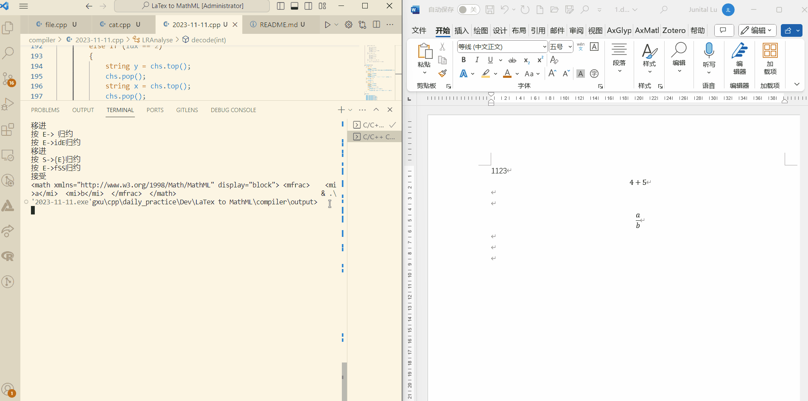
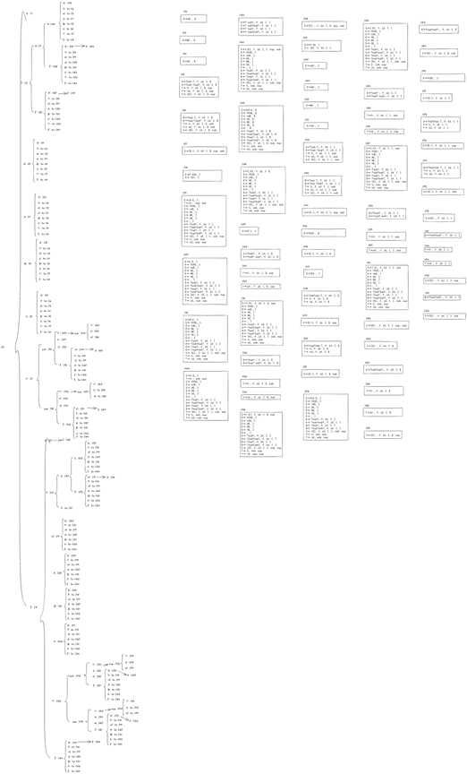

# LaTeX小工具

## 目标

做一个可以实时渲染的LaTeX小窗口，并能自动补全公式。采用增量开发，每次在之前的基础上拓展一些功能。

## 目前版本：v0.0.1

## 阶段性任务

- [ ]LaTeX简单编译器
- [ ]LaTeX渲染器
- [ ]补全功能和显示功能

## 日志

### 2023.11.13

Member: Junital

Past: 版本0.0.2的活前缀DFA画完了，有82个项目集。

### 2023.11.12

Member: Junital

Past: 把版本0.0.1完成了，开始构思版本0.0.2。

### 2023.11.11

Member: Junital

Past: 双十一开始开发，基本上把版本0.0.1完成。
